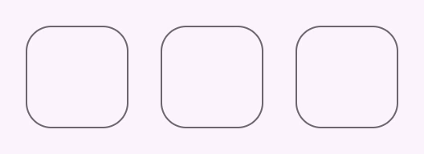
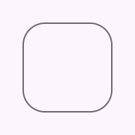
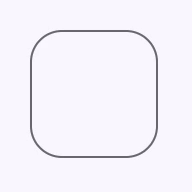
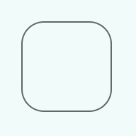

# Focus ring

<!--*
# Document freshness: For more information, see go/fresh-source.
freshness: { owner: 'lizmitchell' reviewed: '2023-11-30' }
tag: 'docType:reference'
*-->

<!-- go/md-focus-ring -->

<!-- [TOC] -->

Focus rings are accessible outlines for components to show keyboard focus.

Focus rings follow the same heuristics as
[`:focus-visible`](https://developer.mozilla.org/en-US/docs/Web/CSS/:focus-visible)<!-- {.external} -->
to determine when they are visible.



*   [API Documentation](#api)
*   [Source code](https://github.com/material-components/material-web/tree/main/focus)
    <!-- {.external} -->

## Usage

Focus rings display on keyboard navigation. They may be attached to a control in
one of three ways.


1.  Attached to the parent element

    
    <button style="position: relative">
      <md-focus-ring style="--md-focus-ring-shape: 8px"></md-focus-ring>
    </button>
    
```html
    <button style="position: relative">
      <FocusRing style="MdFocusRingShape: 8px"></FocusRing>
    </button>
    ```

1.  Attached to a referenced element

    
    <div style="position: relative">
      <md-focus-ring for="control" style="--md-focus-ring-shape: 8px"></md-focus-ring>
      <input id="control">
    </div>
    
```html
    <div style="position: relative">
      <FocusRing for="control" style="MdFocusRingShape: 8px"></FocusRing>
      <input id="control">
    </div>
    ```

1.  Attached imperatively

    
    <div style="position: relative">
      <md-focus-ring id="ring" style="--md-focus-ring-shape: 8px"></md-focus-ring>
      <button id="ring-control"></button>
    </div>
    <script>
      const focusRing = document.querySelector('#ring');
      const control = document.querySelector('#ring-control');
      focusRing.attach(control);
    </script>
    
```html
    <div style="position: relative">
      <FocusRing id="ring" style="MdFocusRingShape: 8px"></FocusRing>
      <button id="ring-control"></button>
    </div>
    <script>
      const focusRing = document.querySelector('#ring');
      const control = document.querySelector('#ring-control');
      focusRing.attach(control);
    </script>
    ```

> Note: focus rings must be placed within a `position: relative` container.

### Inward

Focus rings can be changed to animate inwards by adding an `inward` attribute.
This is useful for components like list items.




<button style="position: relative">
  <md-focus-ring inward style="--md-focus-ring-shape: 8px"></md-focus-ring>
</button>

```html
<button style="position: relative">
  <FocusRing inward style="MdFocusRingShape: 8px"></FocusRing>
</button>
```

### Animation

The focus ring animation may be customized or disabled using CSS custom
properties.




<style>
  md-focus-ring {
    --md-focus-ring-duration: 0s; /* disabled animation */
  }
</style>

```html
<style>
  md-focus-ring {
    --md-focus-ring-duration: 0s; /* disabled animation */
  }
</style>
```

## Accessibility

Focus rings are visual components and do not have assistive technology
requirements.

## Theming

Focus rings supports [Material theming](../theming/README.md) and can be
customized in terms of color and shape.

### Tokens

Token                   | Default value
----------------------- | --------------------------
`--md-focus-ring-color` | `--md-sys-color-secondary`
`--md-focus-ring-shape` | `9999px`
`--md-focus-ring-width` | `3px`

*   [All tokens](https://github.com/material-components/material-web/blob/main/tokens/_md-comp-focus-ring.scss)
    <!-- {.external} -->

### Example




<style>
md-focus-ring {
  --md-focus-ring-shape: 0px;
  --md-focus-ring-width: 2px;
  --md-focus-ring-active-width: 4px;
  --md-sys-color-secondary: #4A6363;
}
</style>

<button>
  <md-focus-ring></md-focus-ring>
</button>

```html
<style>
md-focus-ring {
  --md-focus-ring-shape: 0px;
  --md-focus-ring-width: 2px;
  --md-focus-ring-active-width: 4px;
  --md-sys-color-secondary: #4A6363;
}
</style>

<button>
  <FocusRing></FocusRing>
</button>
```

<!-- auto-generated API docs start -->

## API


### MdFocusRing <code>&lt;md-focus-ring&gt;</code>

#### Properties

<!-- mdformat off(autogenerated might break rendering in catalog) -->

Property | Attribute | Type | Default | Description
--- | --- | --- | --- | ---
`visible` | `visible` | `boolean` | `false` | Makes the focus ring visible.
`inward` | `inward` | `boolean` | `false` | Makes the focus ring animate inwards instead of outwards.
`htmlFor` |  | `string` | `undefined` |
`control` |  | `HTMLElement` | `undefined` |

<!-- mdformat on(autogenerated might break rendering in catalog) -->

#### Methods

<!-- mdformat off(autogenerated might break rendering in catalog) -->

Method | Parameters | Returns | Description
--- | --- | --- | ---
`attach` | `control` | `void` |
`detach` | _None_ | `void` |

<!-- mdformat on(autogenerated might break rendering in catalog) -->

<!-- auto-generated API docs end -->
